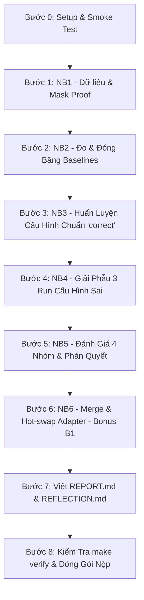

# Kế Hoạch Hoàn Thành Bài Lab 21: Fine-tuning LLMs (Track 3)
> **Mã môn:** AICB-P2T3 · Chương 5 — Fine-tuning & An Toàn  
> **Mục tiêu điểm số:** 100/100 Điểm Cơ Bản + Tối đa 15 Điểm Thưởng (Bonus)  
> **File kế hoạch:** `plan.md`

---

## 🎯 1. Tổng Quan & Mục Tiêu Tối Thượng

Lab 21 yêu cầu giải quyết bài toán: **Phân loại Ticket CSKH tiếng Việt → JSON triage 4 trường** (`intent`, `urgency`, `product`, `sentiment`).

### Hai câu hỏi cốt lõi bắt buộc trả lời:
1. **Phần được tính loss có đúng là câu trả lời của trợ lý (assistant response) không?**  
   *(NB1 — Chứng minh bằng giải mã ngược token mask, không bằng niềm tin)*
2. **Bản fine-tune LoRA có thắng base model khi đã được prompt tử tế (baseline b) không — và bạn có phát hiện được nếu nó không thắng?**  
   *(NB2 đóng băng mốc đánh giá trước khi train, NB5 đưa ra phán quyết qua cổng hồi quy 4 nhóm)*

### Cấu trúc thang điểm (100 điểm chuẩn + 15 điểm thưởng):
* **Tính đúng đắn của pipeline (30đ):** Mask proof đúng, Chat template xử lý chuẩn `<think>`, `max_length` theo p95, train `correct` thành công.
* **Thiết kế thí nghiệm công bằng (25đ):** `attn_only` matched parameter budget (< 5% sai lệch), cùng `max_steps`, mỗi run đổi đúng 1 biến, xếp hạng bằng `target score` ở NB5 (không dùng `train loss` ở NB4).
* **Chất lượng đánh giá & phán quyết (25đ):** Đo baseline (b) trước khi train, đủ 4 nhóm (target, regression, format, latency), phán quyết khách quan (PASS/FAIL đều được điểm nếu phân tích đúng), ≥5 ví dụ định tính (bắt buộc ≥2 ca FT thua).
* **Chất lượng báo cáo (20đ):** Đủ 7 mục trong `REPORT.md`, kết luận ≥150 từ có lập luận nhân quả, số liệu khớp 100% với `results/`, bài học phản tư sâu sắc.
* **Thưởng Bonus (+15đ):** B1 (Merge/Hot-swap +3đ), B2 (Custom dataset +3đ), B3 (Reasoning-trace collapse +4đ), B4 (Quét rank +3đ), B5 (Push HF Hub +2đ).

---

## 💻 2. Chiến Lược Môi Trường Thực Thi (Hardware Tier)

| Môi trường | Cấu hình đề xuất | Tier trong `.env` | Nhiệm vụ thực hiện |
|---|---|---|---|
| **Máy cục bộ (Local CPU / Laptop)** | CPU / GPU nhỏ | `COMPUTE_TIER=CPU` hoặc `LAPTOP` | Chạy NB1 (Mask proof), Unit tests (`make smoke`, `pytest`), chuẩn bị dữ liệu, viết Report & Reflection |
| **Google Colab Free T4 (Khuyến nghị)** | Tesla T4 16GB (14.6GB thực dụng) | `COMPUTE_TIER=T4` *(mặc định)* | Huấn luyện toàn bộ Core (NB2 → NB5) và NB6 trên model `unsloth/Qwen3.5-4B` (fp16 LoRA) |

> [!IMPORTANT]
> **Quy tắc sống còn khi dùng Colab Free T4:**
> 1. **Reload tab (F5)** mỗi khi repo cập nhật code, không chỉ `Reconnect` (tránh lỗi cache notebook F-19).
> 2. **T4 là kiến trúc Turing (sm_75) không hỗ trợ native bf16**: Hệ thống tự chuyển sang `fp16` kèm gradient scaling. Không ép cờ `bf16=True`.
> 3. **Một phiên duy nhất**: Colab free chỉ cho phép 1 GPU session cùng lúc.
> 4. **Quản lý bộ nhớ**: Giữa các run huấn luyện, luôn đảm bảo gọi `generate.free_memory()` để tránh OOM.

---

## 🗺️ 3. Lộ Trình Triển Khai Từng Bước (Step-by-Step Plan)



---

### 🔹 GIAI ĐOẠN 1: Chuẩn Bị & Xác Minh Nền Tảng (Local / Colab)

#### Bước 0: Khởi tạo môi trường & Smoke Test
- [ ] Sao chép file cấu hình: `cp .env.example .env`
- [ ] Thiết lập `COMPUTE_TIER=T4` (hoặc `CPU` nếu test nhanh trên máy cá nhân).
- [ ] Chạy kiểm tra tích hợp:
  ```bash
  make setup-cpu   # (hoặc make setup nếu có GPU)
  make smoke       # Kiểm tra imports, dữ liệu mẫu, và toàn bộ unit tests
  ```
- [ ] Đảm bảo `tests/` pass 100% trước khi chạy bất kỳ notebook nào.

#### Bước 1: NB1 — Dữ Liệu, Chat Template & Mask Proof
*Thời gian ước tính: ~25 giây (chạy trên CPU)*
* File thực thi: `notebooks/01_data_and_mask.py` (hoặc ô NB1 trong Colab)
* **Nhiệm vụ trọng tâm:**
  1. Phân tích token length distribution, đo p95 để xác định ngưỡng `max_length` (tránh cắt cụt nhãn hoặc lãng phí VRAM).
  2. Kiểm tra Chat Template của `Qwen3.5-4B`: xác định cơ chế xử lý khối `<think></think>` (đặc biệt khi câu trả lời không có reasoning).
  3. **Tạo Mask Proof**: Giải mã ngược token tại các vị trí tính loss (`label != -100`) và vị trí bị che (`label == -100`).
  4. Phân chia tập dữ liệu train/val cố định với `seed=42`.
* **Đầu ra bắt buộc:**
  - `results/mask_proof.json`
  - `results/template_check.json`
  - `results/token_stats.json`
  - `data/split/train.jsonl` và `data/split/val.jsonl`
* **Tiêu chí nghiệm thu (Rubric 1.1 - 1.3):**
  - `mask_proof.json` có `answer_is_supervised: true` và `question_is_masked: true`.
  - `supervised_fraction < 0.95` (nếu ≥ 0.95 nghĩa là đang tính loss cả vào prompt -> rớt tiêu chí 1.1).

---

### 🔹 GIAI ĐOẠN 2: Đóng Băng Mốc So Sánh & Huấn Luyện (GPU T4)

#### Bước 2: NB2 — Đóng Băng Mốc Đánh Giá & Đo Ba Baseline
*Thời gian ước tính: ~17–23 phút (trên T4)*
* File thực thi: `notebooks/02_baselines.py`
* **Nhiệm vụ trọng tâm:**
  1. Đóng băng tập dữ liệu kiểm thử `eval_target.jsonl` và `eval_regression.jsonl`.
  2. Đo **Baseline (a)**: Base model + Naive Prompt (prompt thô sơ, chưa tối ưu).
  3. Đo **Baseline (b)**: Base model + Optimized Prompt (prompt công phu với hướng dẫn JSON & 4 trường).
  4. Đảm bảo quy tắc: Baseline (b) phải được đo **TRƯỚC KHI** thực hiện bất kỳ bước huấn luyện nào.
* **Đầu ra bắt buộc:**
  - `results/baselines_frozen.json`
* **Tiêu chí nghiệm thu (Rubric 3.1):**
  - Baseline (b) phải thực sự vượt trội hơn Baseline (a) trên tập target: `(b) > (a)`.
  - Checksum SHA của prompt (b) được lưu lại để kiểm tra tính liêm chính khoa học (không được làm yếu prompt b để tâng bốc bản fine-tune).

#### Bước 3: NB3 — Huấn Luyện Cấu Hình Chuẩn `correct`
*Thời gian ước tính: ~15–25 phút (trên T4)*
* File thực thi: `notebooks/03_train_correct.py`
* **Nhiệm vụ trọng tâm:**
  1. Áp dụng nguyên lý *LoRA Without Regret* (Thinking Machines 2025 / Deck §10):
     - `target_modules="text-linear"`: Gắn LoRA vào toàn bộ 12 module tuyến tính của text decoder (kể cả Gated DeltaNet linear attention).
     - Rank `r=16`, `lora_alpha=16`.
     - Learning rate chuẩn LoRA: `lr=1e-4` (thang 1e-4 đến 3e-4, không dùng thang 1e-5 của Full-FT).
     - Batch size hiệu dụng: `per_device_batch=1` × `grad_accum=16` = 16 (< 32 theo Deck §10.4).
  2. Huấn luyện 2 epochs với `MASK_MODE=assistant-only`.
  3. Lưu adapter và giải phóng bộ nhớ GPU.
* **Đầu ra bắt buộc:**
  - `adapters/correct/adapter_model.safetensors` và `adapter_config.json`
  - Ghi dòng `correct` vào `results/runs.csv` (ghi nhận train loss, thời gian train, peak VRAM).

---

### 🔹 GIAI ĐOẠN 3: Thí Nghiệm Đối Chứng & Phán Quyết Toàn Diện

#### Bước 4: NB4 — Giải Phẫu Cấu Hình Sai (Misconfiguration Autopsy)
*Thời gian ước tính: ~45–60 phút (trên T4)*
* File thực thi: `notebooks/04_misconfig_autopsy.py`
* **Nhiệm vụ trọng tâm (Chạy 3 run đối chứng với cùng `max_steps` như run `correct`):**
  1. **Run 1 — `attn_only` (Lỗi vị trí #1):** Chỉ gắn adapter vào `q_proj, v_proj`. **Bắt buộc dùng `matched_rank()`** (r≈283 trên Qwen3.5-4B) để tổng số tham số huấn luyện xấp xỉ `correct` (sai lệch < 5%). Điều này giúp cô lập biến *vị trí* thay vì biến *ngân sách tham số*.
  2. **Run 2 — `wrong_lr` (Lỗi siêu tham số #2):** Gắn full text-linear, r=16, nhưng dùng `lr=1e-5` (nhầm thang đo của Full Fine-Tuning).
  3. **Run 3 — `qlora` (Lỗi lượng tử hóa #3):** Nạp base model 4-bit (NF4) để đo mức giảm VRAM và đánh giá sai số lượng tử.
* **Đầu ra bắt buộc:**
  - Cập nhật 3 dòng tương ứng (`attn_only`, `wrong_lr`, `qlora`) vào `results/runs.csv`.
* **Tiêu chí nghiệm thu (Rubric 2.1 - 2.3):**
  - Cả 4 run đều có cùng `max_steps`.
  - `attn_only` có trainable parameters chênh lệch < 5% so với `correct`.

#### Bước 5: NB5 — Đánh Giá 4 Nhóm & Phán Quyết Hồi Quy
*Thời gian ước tính: ~21 phút (trên T4)*
* File thực thi: `notebooks/05_evaluate_and_verdict.py`
* **Nhiệm vụ trọng tâm:**
  1. **Đo lường 4 nhóm chỉ số khách quan:**
     - **Target accuracy:** Độ chính xác khớp nhãn 4 trường JSON trên tập kiểm thử.
     - **Regression score:** Đánh giá 15 câu hỏi tổng quát xem model có bị "quên thảm họa" (catastrophic forgetting) không.
     - **Format valid rate:** Tỷ lệ JSON parse được và có đủ 4 khóa.
     - **Latency:** Thời gian sinh phản hồi (ms/mẫu, greedy decoding).
  2. **Chấm điểm 3 run đối chứng của NB4 trên tập TARGET (NB5 §4):** Xếp hạng thực sự theo năng lực nghiệp vụ, vạch trần nghịch lý "Train loss thấp nhưng Target score tệ".
  3. **Cổng phán quyết (Regression Gate):** Xác định PASS/FAIL dựa trên điều kiện:
     $$\Delta \text{target} = \text{Target}_{(c)} - \text{Target}_{(b)} > 0 \quad \text{và} \quad \Delta \text{regression} = \text{Reg}_{(c)} - \text{Reg}_{(b)} \ge -0.05$$
  4. Trích xuất ≥5 mẫu định tính (bao gồm các ca FT thắng và **bắt buộc có ≥2 ca FT thua**).
* **Đầu ra bắt buộc:**
  - `results/verdict.json`
  - `results/autopsy.json`
  - `results/qualitative.json`

---

### 🔹 GIAI ĐOẠN 4: Thử Thách Mở Rộng & Điểm Thưởng (Bonus Challenges)

*Mục tiêu: Đạt tối đa +15 điểm thưởng vào tổng kết quả.*

- [ ] **B1 — NB6 Merge & Hot-Swap Adapter (+3 điểm):**
  - Chạy `notebooks/06_merge_and_serve.py`.
  - Thực hiện merge adapter vào base weights, kiểm tra sai số suy luận không tụt quá 0.01 (`results/merge_check.json`).
  - Trình diễn hot-swap ≥2 adapter trên cùng 1 base model đang nạp trong RAM/VRAM.
- [ ] **B2 — Dataset Miền Riêng (+3 điểm):**
  - Chuẩn bị ≥200 mẫu chất lượng cao thuộc lĩnh vực tự chọn.
  - Tạo tài liệu `data/CUSTOM_DATASET.md` giải trình nguồn dữ liệu, quy trình khử nhiễm (contamination cleaning), và tính mới về mặt phân phối.
- [ ] **B3 — Khảo Sát Suy Thoái Chuỗi Suy Luận (Reasoning-Trace Collapse) (+4 điểm):**
  - Huấn luyện 2 lượt với `MASK_MODE=assistant-only` và `MASK_MODE=response-only`.
  - Báo cáo chỉ số `valid_trace_rate` và phân tích hiện tượng mất khả năng reasoning dù accuracy vẫn tăng.
- [ ] **B4 — Quét Rank Có Kiểm Soát (+3 điểm):**
  - Cố định `target_modules="text-linear"`, quét $r \in \{8, 16, 64\}$.
  - Phân tích tương quan giữa dung lượng rank và lượng thông tin trong 250 mẫu dữ liệu.
- [ ] **B5 — Public Adapter lên Hugging Face Hub (+2 điểm):**
  - Push adapter `adapters/correct/` lên Hugging Face Hub cá nhân và đính kèm link trong báo cáo.

---

### 🔹 GIAI ĐOẠN 5: Hoàn Thiện Báo Cáo & Nghiệm Thu (Gatekeeper)

#### Bước 6: Soạn Thảo `submission/REPORT.md` & `submission/REFLECTION.md`
- [ ] Điền đầy đủ 7 phần trong `submission/REPORT.md`:
  1. **Setup:** Thông tin phần cứng, model, dataset, `max_length` (khớp p95), cấu hình template `<think>`.
  2. **Mask proof:** Số liệu `supervised_fraction`, kết quả 2 assert, dán 3–5 dòng token được giải mã.
  3. **Ba baseline:** Bảng so sánh (a), (b), (c) trên 4 nhóm chỉ số. Giải trình tính hiệu quả của prompt (b).
  4. **Giải phẫu cấu hình sai:** Bảng so sánh 4 run NB4 + Trả lời sâu 3 câu hỏi (4.1 Vị trí vs Rank; 4.2 Tác động của Learning Rate; 4.3 Đánh đổi VRAM vs Chất lượng của QLoRA).
  5. **Phán quyết hồi quy:** Phân tích chi tiết kết quả PASS/FAIL từ `verdict.json` (≥100 từ).
  6. **Đánh giá định tính:** Bảng 5 ví dụ cụ thể với ít nhất 2 ca Fine-tune THUA (tránh cherry-picking).
  7. **Kết luận & Điều học được:** Kết luận sâu sắc (≥150 từ, phân tích quan hệ nhân quả) + 3 bài học thực chiến cụ thể.
- [ ] Hoàn thành 5 câu hỏi phản tư cá nhân trong `submission/REFLECTION.md`.

#### Bước 7: Chạy Gatekeeper Kiểm Tra Trước Khi Nộp
- [ ] Thực thi script kiểm thử nghiệm thu:
  ```bash
  python scripts/verify.py
  # hoặc: make verify
  ```
- [ ] **Yêu cầu bắt buộc:** Kết quả phải in ra dòng `Ready to submit.` với **0 FAIL** và **0 placeholder `<điền>` / `<paste>`**.

#### Bước 8: Đóng Gói Hồ Sơ Nộp Bài
Lựa chọn một trong các định dạng nộp theo Rubric:
* **Option A (Khuyến nghị - ZIP gọn ~10–15 MB):**
  ```
  lab21_<MSSV>/
  ├── submission/
  │   ├── REPORT.md
  │   └── REFLECTION.md
  ├── results/              # Toàn bộ file .json và runs.csv
  ├── adapters/correct/     # adapter_model.safetensors + config
  └── notebooks/            # Code notebook sạch
  ```
* **Option B (GitHub + HuggingFace Hub +2 điểm B5):** Chứa `REPORT.md`, `results/`, và `LINKS.md`.

---

## ⚠️ 4. Bảng Phòng Tránh Sai Lầm Thường Gặp (Anti-Patterns Checklist)

| STT | Triệu chứng / Sai lầm | Hậu quả theo Rubric | Cách xử lý chuẩn |
|:---:|---|---|---|
| 1 | **Tính loss trên cả Prompt** (`supervised_fraction ≥ 0.95`) | Mất trắng 10 điểm mục 1.1 | Sử dụng `data.build_example()` với offset mapping chuẩn xác, assert `question_is_masked: true`. |
| 2 | **So sánh `attn_only` không cân bằng tham số** (ví dụ giữ nguyên $r=16$) | Bị trừ 10 điểm mục 2.1 vì so sánh sai lệch ngân sách | Dùng hàm `matched_rank()` để tự động tính $r \approx 283$, đảm bảo sai lệch tham số < 5%. |
| 3 | **Xếp hạng 4 run NB4 bằng `train_loss` thay vì `target_score`** | Bị trừ điểm mục 2.4, 2.5 và mục 3 | Luôn đánh giá run đối chứng ở NB5 §4 bằng điểm số trên tập test target. Vạch trần nghịch lý loss thấp nhưng target kém. |
| 4 | **Chỉ báo cáo các ca Fine-tune Thắng** (Cherry-picking) | Bị trừ sạch 5 điểm mục 3.4 | Bắt buộc chọn ít nhất 2 ca Fine-tune THUA Baseline (b) và phân tích nguyên nhân thất bại. |
| 5 | **Nộp bài khi còn bật `EVAL_LIMIT=8`** | `make verify` sẽ báo FAIL ngay lập tức | Bỏ comment hoặc xóa `EVAL_LIMIT` trong `.env` trước khi chạy run nộp bài cuối cùng. |
| 6 | **Để sót placeholder `<điền>`, `<paste>` trong báo cáo** | `make verify` phát hiện và đánh rớt | Rà soát kỹ lưỡng toàn bộ text trong `REPORT.md` và `REFLECTION.md`. |

---

## ⏱️ 5. Bảng Phân Bổ Thời Gian (Time Budget - T4 Free)

```
[Tổng thời gian ước tính: ~2.5 giờ]
├── Giai đoạn 1: NB1 + Smoke test (Local/Colab)     : ~5 phút
├── Giai đoạn 2: NB2 Baseline Freezing (Colab T4)   : ~20 phút
├── Giai đoạn 3: NB3 Train Correct (Colab T4)       : ~20 phút
├── Giai đoạn 4: NB4 3 Ablation Runs (Colab T4)     : ~50 phút
├── Giai đoạn 5: NB5 Eval & Verdict (Colab T4)      : ~20 phút
├── Giai đoạn 6: NB6 Merge & Serve (Tùy chọn B1)    : ~10 phút
└── Giai đoạn 7: Viết Report + Reflection + Verify   : ~30 phút
```

---
*Kế hoạch này là kim chỉ nam đảm bảo bài nộp đạt điểm tối đa (100+15), tuân thủ tuyệt đối tính liêm chính khoa học và tối ưu hóa thời gian thực thi.*
